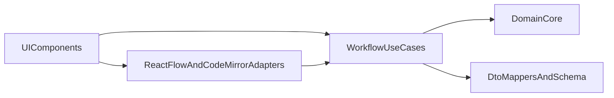

# Architecture Audit And Refactor Plan

## Цель

Стабилизировать и упростить архитектуру workflow-редактора в `n8n`-подобном пакете так, чтобы поведение было предсказуемым, слои были четко разделены, а критичные сценарии покрыты тестами.

## Ключевые наблюдения (аудит)

- В слое editor-композиции слишком широкая связка с store: `WorkflowEditor` подписывается на множество селекторов и совмещает orchestration/UI в одном месте (`[packages/flow/src/workflow/components/workflow-editor.tsx](packages/flow/src/workflow/components/workflow-editor.tsx)`).
- Есть риск рассинхронизации viewport между store и canvas из-за `defaultViewport` вместо управляемой синхронизации (`[packages/flow/src/workflow/components/workflow-canvas.tsx](packages/flow/src/workflow/components/workflow-canvas.tsx)`, `[packages/flow/src/workflow/store.ts](packages/flow/src/workflow/store.ts)`).
- Expression-ссылки строятся по label (`$("Node Label")`), что неустойчиво к rename/duplicate label и усложняет эволюцию контракта (`[packages/flow/src/workflow/expression/variables.ts](packages/flow/src/workflow/expression/variables.ts)`).
- Контракты импорта/экспорта неоднородны: metadata частично теряется/перезаписывается, а `sanitizeConfigValue` пока заглушка (`[packages/flow/src/workflow/mappers.ts](packages/flow/src/workflow/mappers.ts)`).
- Типизация config в runtime менее строгая, чем доменная модель (`JsonObject` в node data), из-за чего часть инвариантов проверяется только при импорте (`[packages/flow/src/workflow/types.ts](packages/flow/src/workflow/types.ts)`, `[packages/flow/src/workflow/node-registry.ts](packages/flow/src/workflow/node-registry.ts)`, `[packages/flow/src/workflow/store.ts](packages/flow/src/workflow/store.ts)`).
- Недостаточное покрытие критических UX-интеграций: canvas/DnD/editor-toolbar/editor-shell (есть хорошие unit/integration тесты доменной логики, но мало интеграционных сценариев уровня пользовательских флоу).

## Целевая архитектура (после рефакторинга)

- **Domain Core**: чистые контракты workflow + expression + validation без UI зависимостей.
- **Application Layer**: use-case actions (add/connect/update/import/export/history) как единая точка бизнес-операций.
- **UI Layer**: components + adapters к ReactFlow/CodeMirror без бизнес-решений внутри.
- **Persistence/Interop**: отдельный модуль контрактов DTO и миграций версий схем.

## План работ по фазам

### Фаза 1 — Зафиксировать архитектурные инварианты (быстрый выигрыш)

- Вынести и формализовать инварианты состояния/истории: когда commit в history, когда transient update.
- Добавить тесты на store-контракты: `onConnect` success/fail, `onNodesChange` drag start/end, `onEdgesChange`, `onMoveEnd`, `updateNodeLabel`, `updateNodeConfigField`.
- Файлы: `[packages/flow/src/workflow/store.ts](packages/flow/src/workflow/store.ts)`, `[packages/flow/src/workflow/store.test.ts](packages/flow/src/workflow/store.test.ts)`, `[packages/flow/src/workflow/validation.ts](packages/flow/src/workflow/validation.ts)`.

### Фаза 2 — Разгрузить editor-композицию и стабилизировать render-модель

- Разделить `WorkflowEditor` на orchestration container + независимые sub-containers (`ToolbarContainer`, `CanvasContainer`, `ConfigPanelContainer`).
- Перейти к агрегированным селекторам с shallow-сравнением для снижения subscription churn.
- Убрать UI-derived вычисления из корневого контейнера (expression catalog и selected node через memoized selectors/use-cases).
- Файлы: `[packages/flow/src/workflow/components/workflow-editor.tsx](packages/flow/src/workflow/components/workflow-editor.tsx)`.

### Фаза 3 — Исправить контракт viewport и синхронизацию canvas

- Перевести viewport на управляемую двухстороннюю модель (store <-/-> ReactFlow API), не опираясь на mount-only семантику.
- Добавить smoke/integration тесты на сохранение/восстановление viewport после import/undo/redo.
- Файлы: `[packages/flow/src/workflow/components/workflow-canvas.tsx](packages/flow/src/workflow/components/workflow-canvas.tsx)`, `[packages/flow/src/workflow/store.ts](packages/flow/src/workflow/store.ts)`.

### Фаза 4 — Перепроектировать expression references (breaking change разрешен)

- Ввести стабильные ссылки по nodeId (`$node("<id>")` или эквивалент) вместо label-based ссылок.
- Добавить миграцию старого формата (`$("Label")`) и стратегию совместимости на период перехода.
- Централизовать built-in переменные в одном модуле, чтобы исключить дубли между autocomplete и catalog.
- Файлы: `[packages/flow/src/workflow/expression/variables.ts](packages/flow/src/workflow/expression/variables.ts)`, `[packages/flow/src/workflow/expression/autocomplete.ts](packages/flow/src/workflow/expression/autocomplete.ts)`, `[packages/flow/src/workflow/expression/template.ts](packages/flow/src/workflow/expression/template.ts)`, `[packages/flow/src/workflow/components/expression-input.tsx](packages/flow/src/workflow/components/expression-input.tsx)`.

### Фаза 5 — Нормализовать DTO-контракты и миграции схем

- Зафиксировать версионирование domain DTO, сохранить/пробросить metadata корректно.
- Реализовать `sanitizeConfigValue` и валидацию config по registry schema на import/export boundary.
- Подготовить schema-migration policy (v1 -> v2) с явными трансформациями.
- Файлы: `[packages/flow/src/workflow/mappers.ts](packages/flow/src/workflow/mappers.ts)`, `[packages/flow/src/workflow/types.ts](packages/flow/src/workflow/types.ts)`, `[packages/flow/src/workflow/node-registry.ts](packages/flow/src/workflow/node-registry.ts)`.

### Фаза 6 — Тестовая архитектура и quality gates

- Добавить integration тесты для `workflow-canvas` (DnD/select/connect), `editor-toolbar` (clipboard/import/status), `workflow-editor` (wiring).
- Добавить Vitest-сценарии пользовательских флоу (add node, connect, undo/redo, import/export, expression insert) через `jsdom`, где это применимо.
- Ввести минимальные архитектурные quality-gates: coverage на критические use-cases, performance smoke для pan/drag.
- Файлы: `[packages/flow/src/workflow/components/workflow-canvas.tsx](packages/flow/src/workflow/components/workflow-canvas.tsx)`, `[packages/flow/src/workflow/components/editor-toolbar.tsx](packages/flow/src/workflow/components/editor-toolbar.tsx)`, `[packages/flow/src/workflow/components/workflow-editor.tsx](packages/flow/src/workflow/components/workflow-editor.tsx)`, существующие `*.test.ts(x)` в `[packages/flow/src/workflow/](packages/flow/src/workflow/)`.

## Результат после выполнения

- Менее хрупкая модель данных и expression-контрактов.
- Предсказуемый history/viewport без скрытых рассинхронов.
- Четкое разделение слоев (Domain/App/UI), проще вносить изменения и ревьюить.
- Снижение регрессий за счет усиленного тест-контурa на критичных пользовательских сценариях.
