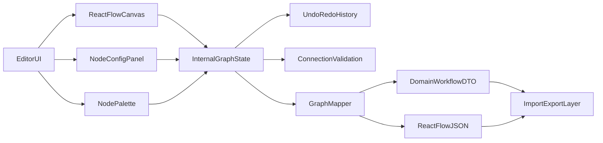

# План для агента: MVP n8n-like на React Flow

## Цели MVP

- Реализовать визуальный editor workflow в `apps/web` с использованием `@workspace/flow`.
- Поддержать сценарии:
  - создание графа через drag&drop из палитры;
  - настройка ноды через панель параметров (включая кастомные input-поля);
  - валидация соединений;
  - undo/redo;
  - mini-map/controls/background;
  - import/export JSON;
  - восстановление workflow из JSON, пришедшего с backend.
- Зафиксировать модель данных: **internal React Flow state + mapper в доменный DTO**.

## Подтверждённые продуктовые рамки

- Фокус: **визуальный редактор + JSON-интеграция**, без реализации backend.
- Ноды первой версии: базовые (ветвление, transform, code, ноды с настраиваемыми полями).
- Контракт backend пока не фиксирован, поэтому нужен адаптерный слой mapper.

## Текущее состояние кода

- В `@workspace/flow` уже есть минимальный React Flow с `nodes/edges` и handlers.
- Точка подключения в web-приложении уже настроена.

Ключевые файлы:

- `[apps/web/app/page.tsx](apps/web/app/page.tsx)`
- `[packages/flow/src/index.tsx](packages/flow/src/index.tsx)`
- `[packages/flow/package.json](packages/flow/package.json)`
- `[packages/store/package.json](packages/store/package.json)`

## Архитектура MVP

## Пошаговый план реализации

### 1) Типизация и модели workflow

- Создать/обновить типы в `packages/flow/src`:
  - `NodeKind` (trigger/transform/branch/code/customInput);
  - `NodeData` с `config` и метаданными UI;
  - `DomainWorkflowDTO` (id/name/version/nodes/connections/metadata).
- Ввести registry нод (описание ноды, дефолтный config, схема полей панели настройки, правила подключений).

### 2) Слой состояния (store)

- Использовать `@workspace/store` (zustand) для:
  - текущего графа (`nodes`, `edges`, `viewport`),
  - выделения (`selectedNodeId`),
  - истории изменений (undo/redo stack),
  - действий (`addNode`, `updateNodeConfig`, `connectNodes`, `deleteSelection`, `undo`, `redo`, `importJson`, `exportJson`).
- Не смешивать сырые callbacks React Flow и бизнес-действия: handlers должны вызывать store-actions.

### 3) UI-композиция редактора

- Разбить `packages/flow/src/index.tsx` на компоненты:
  - `WorkflowEditor` (layout),
  - `WorkflowCanvas` (ReactFlow + MiniMap + Controls + Background),
  - `NodePalette` (drag source + кнопки добавления),
  - `NodeConfigPanel` (динамическая форма по registry).
- Обеспечить стабильный UX выделения ноды и обновления формы конфигурации.

### 4) Ноды и кастомные инпуты

- Добавить базовые node-компоненты:
  - Branch node (условие + 2+ output handles),
  - Transform node (mapping/выражение),
  - Code node (строковый script/pseudocode),
  - Generic CustomInput node (динамические поля: text/number/select/boolean).
- Все поля редактируются через `NodeConfigPanel`; в `data` хранится только сериализуемая структура.

### 5) Валидация связей

- Реализовать `isValidConnection` на базе правил из registry:
  - ограничение по типам source/target,
  - запрет недопустимых комбинаций,
  - опционально защита от циклов (если правило включено).
- Возвращать понятные ошибки для UI (toast/status message) через единый validation helper.

### 6) Undo/Redo

- Snapshot-based history на уровне store:
  - push снапшота только на завершённых действиях пользователя;
  - лимит глубины истории (например 50);
  - корректная очистка redo при новом действии после undo.
- Горячие клавиши (`Cmd/Ctrl+Z`, `Shift+Cmd/Ctrl+Z` или `Cmd/Ctrl+Y`).

### 7) JSON import/export + mapper

- Реализовать два формата:
  - internal React Flow JSON (`nodes/edges/viewport`),
  - domain DTO (адаптированный контракт для backend).
- Добавить mapper-функции:
  - `internalToDomain(graphState) => DomainWorkflowDTO`,
  - `domainToInternal(dto) => GraphState`.
- Добавить UI-действия: copy/export JSON и import/paste JSON с базовой валидацией схемы.

### 8) Интеграция в `apps/web`

- Сохранить публичный экспорт `Flow`, но внутри подключить новый `WorkflowEditor`.
- Убедиться, что страница `apps/web/app/page.tsx` остаётся тонкой обёрткой без бизнес-логики.

### 9) Проверка качества

- Typecheck/lint для изменённых пакетов.
- Обязательные **unit-тесты на Vitest** для:
  - mapper (`internalToDomain`, `domainToInternal`);
  - validation helper (`isValidConnection` + edge-cases);
  - history manager (undo/redo push/reset/limits);
  - store actions (критичные переходы состояния);
  - parser/normalizer импортируемого JSON (валидный/невалидный формат).
- Дополнительно smoke-checklist UI:
  - создать граф, соединить ноды, отредактировать config;
  - undo/redo корректно работает;
  - export -> import восстанавливает эквивалентный граф;
  - domain mapper не теряет данные.

### 10) Инженерные ограничения реализации

- Декомпозировать код на небольшие модули и компоненты; избегать больших монолитных файлов/функций.
- Вынести бизнес-логику из UI-компонентов в чистые функции/сервисы, чтобы их можно было тестировать отдельно.
- Использовать строгую типизацию TypeScript:
  - **запрещено** использовать `any` и `as any`;
  - для внешних/неизвестных данных применять `unknown` + type guards/валидаторы;
  - типы нод/конфигов/DTO должны быть дискриминированными union-типами, где применимо.

## Критерии готовности (Definition of Done)

- Редактор поддерживает все выбранные функции MVP.
- Граф можно восстановить из JSON и сериализовать обратно в два формата.
- Конфигурация нод полностью сериализуема и редактируется через UI.
- Архитектура отделяет canvas-state от backend DTO через mapper.
- Нет type/lint ошибок в затронутых пакетах.
- Unit-тесты на Vitest покрывают ключевые модули (mapper/validation/history/store/import).
- В изменённом коде отсутствуют `any` и `as any`.
- Компоненты и логика декомпозированы на небольшие, тестируемые единицы.

## Ограничения и решения

- Backend контракт не фиксирован: поддерживаем адаптерный слой mapper как точку эволюции.
- Сложные runtime-исполнения workflow не входят в текущий scope.

## Рекомендуемый порядок работы агента

1. Типы + registry + store actions.
2. UI-компоненты editor/palette/panel.
3. Базовые ноды и валидация подключений.
4. Undo/redo.
5. Import/export + mapper.
6. Интеграция в web.
7. Unit-тесты на Vitest и финальные проверки качества.
